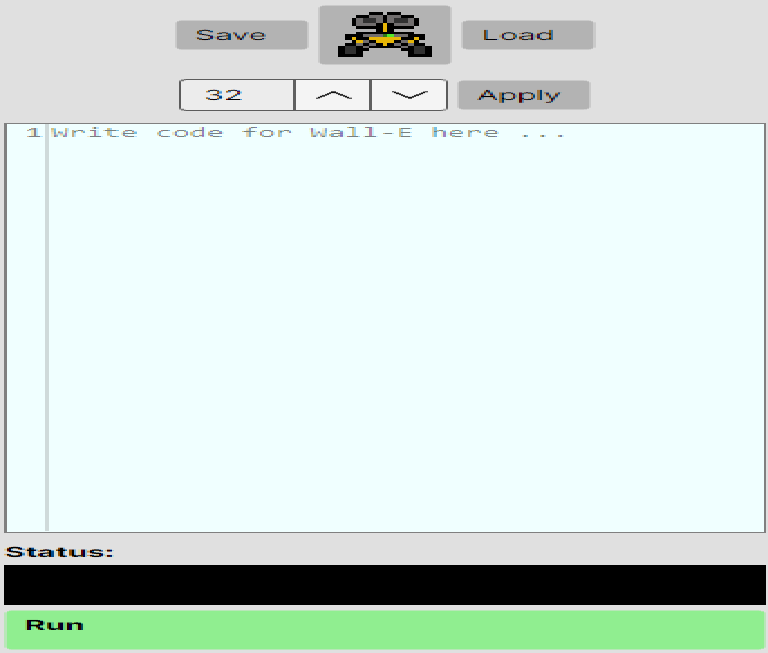
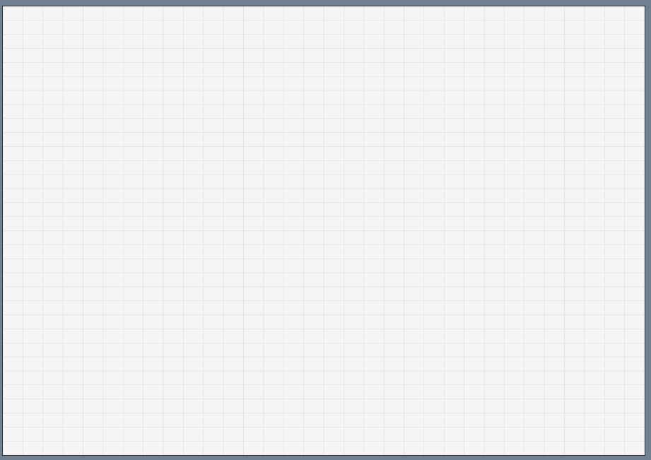
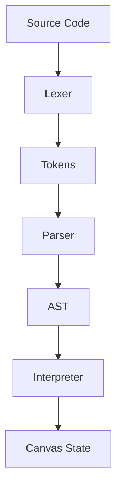

# 🎨 Pixel Wall-E - Pixel Art Programming Environment

<div align="center">
  
  
  <br>
  
</div>

## 📝 Project Description

Pixel Wall-E is an educational programming environment that interprets a custom language to create pixel art. Developed with **Avalonia** for the **MATCOM Faculty (2024-2025)**.

This application allows users to write programs in a domain-specific language (DSL) to control a virtual robot (Wall-E) that paints on a pixel canvas. The project includes a complete interpreter and graphical interface.

## ✨ Key Features

### 🖌️ Programming Language
- Drawing commands (`Spawn`, `Color`, `Size`, `DrawLine`, `DrawCircle`, `DrawRectangle`, `Fill`)
- Variable system (numeric and boolean)
- Expressions and functions (`GetActualX`, `GetActualY`, `GetCanvasSize`, etc.)
- Control flow with labels and conditional jumps (`GoTo`)

### 🖥️ Graphical Interface
| Code Editor | Canvas |
|-------------|--------|
|  |  |

- Code editor with line numbering
- Pixel canvas with grid display
- Canvas size configuration (n x n)
- Execution control buttons:
  - Run program
  - Reset canvas
  - Save/Load `.pw` files
  - Export code

### 📁 File Operations
- Save programs in `.pw` format
- Load existing `.pw` files
- Export current code as text file

## 🚀 Installation and Execution

### Prerequisites
- [.NET 7.0 or later](https://dotnet.microsoft.com/download)
- Git (optional)

### Steps to Run
```bash
# Clone repository
git clone https://github.com/your-username/pixel-walle.git
cd pixel-walle

# Restore dependencies and build
dotnet restore
dotnet build

# Run application
dotnet run --project src/PixelWallE
```
### Download Executable
- Go to Releases
- Download the latest version
- Run PixelWallE.exe

## 🧠 Interpreter Logic

The interpreter follows this processing pipeline:



### Lexical Analysis (Lexer):

- Converts source code into tokens
- Identifies keywords, variables, literals, and operators
- Detects lexical errors (invalid characters)

### Syntax Analysis (Parser / AST):

- Builds Abstract Syntax Tree (AST)
- Validates grammatical structure
- Ensures proper command sequencing
- Detects syntax errors

### Evaluation (Interpreter):

- Executes AST commands
- Manages variables and function calls
- Handles runtime errors

### Visual (PixelCanvasControl)

- Maintains global state (position, color, etc.)
- Updates canvas (pixel matrix)

## 📄 License
This project is licensed under the MIT License - see the LICENSE file for details.

